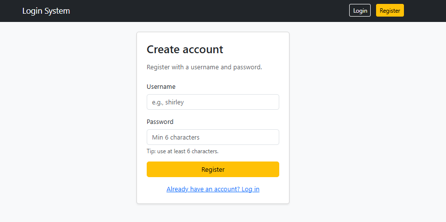
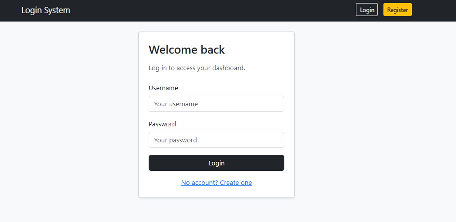
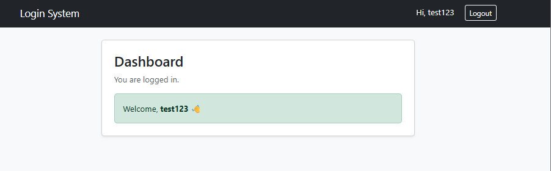

# PHP Login & Register System

A simple authentication system built with PHP and MySQL.

This project is part of my backend developer learning journey and will be continuously improved.

---

## Current Features

- ✅ User registration
- ✅ User login
- ✅ Password hashing
- ✅ Session authentication
- ✅ Dashboard page
- ✅ Logout

---

## Screenshots

### Register Page

---

### Login Page

---

### Dashboard

---

## Upgrade Checklist

### Security

- ✅ Password hashing
- ⬜ Prevent SQL injection
- ⬜ Add input validation
- ⬜ Add password strength validation

---

### User Features

- ⬜ Edit profile
- ⬜ Change password
- ⬜ Delete account

---

### UI Improvements

- ✅ Add Bootstrap styling
- ⬜ Improve login page design
- ⬜ Add navigation bar

---

### Advanced Features

- ⬜ Remember me
- ⬜ Email verification
- ⬜ Password reset

---

### Backend Improvements

- ⬜ Refactor code into functions
- ⬜ Use MVC structure
- ⬜ Convert project to Laravel

---

## Technologies Used

- PHP
- MySQL
- PDO
- XAMPP

---

## How to Run

1. Start XAMPP (Apache and MySQL)

2. Open

http://localhost/login-system/register.php

---

## Project Purpose

This project demonstrates backend development skills including:

- Authentication
- Database integration
- Session management

---

## Author

Shiyan Wei

GitHub: https://github.com/weishiy